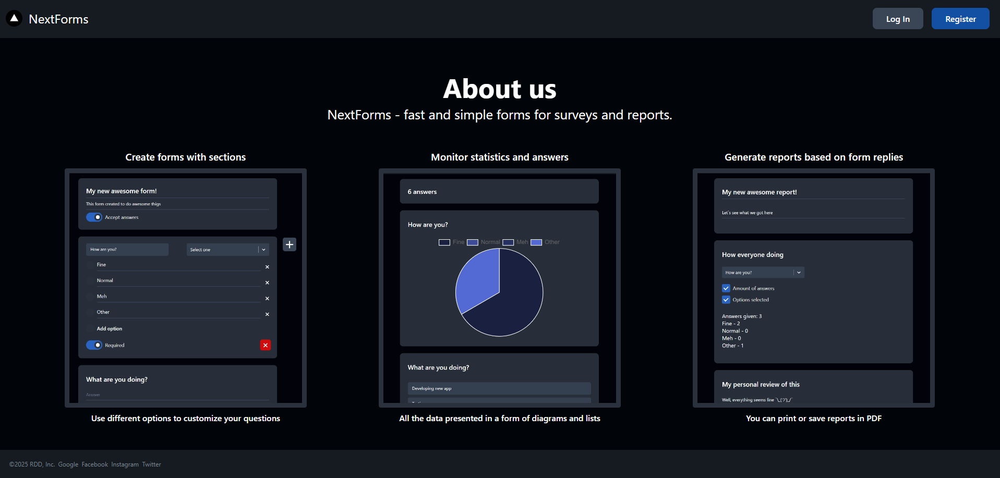

<br/>
<p align="center">
  <a href="https://github.com/ShaanCoding/ReadME-Generator">
    
  </a>

<h3 align="center">NextForms</h3>

<p align="center">
An application to create and manage custom forms!
<br/>
Note This Project Is Still W.I.P
<br/>
<br/>
<a href="https://github.com/VektorDio/Nextforms">Explore the docs</a>
.
<a href="https://github.com/VektorDio/Nextforms/issues">Report Bug</a>
.
<a href="https://github.com/VektorDio/Nextforms/issues">Request Feature</a>
</p>

  

## Table Of Contents

- [Table Of Contents](#table-of-contents)
- [About The Project](#about-the-project)
- [Built With](#built-with)
- [Getting Started](#getting-started)
    - [Prerequisites](#prerequisites)
    - [Installation](#installation)
- [License](#license)
- [Authors](#authors)

## About The Project



This is simple web-application, aimed to provide basic form and report functionality with some statistics.
You can use this to conduct simple surveys and extract report PDFs. 

And this is a training for developing and deploying complex applications.

## Built With

- [JavaScript](https://www.javascript.com/)
- [Next.js](https://nextjs.org/)
- [React](https://react.dev/)
- [Prisma](https://www.prisma.io/)
- [MongoDB](https://www.mongodb.com/)

## Getting Started

To get a local copy up and running follow these simple example steps.

### Prerequisites

You need server and database for this one

### Installation

1. Clone the repo
```sh
git clone https://github.com/VektorDio/Nextforms.git
```
2. Install all necessary packages
3. Config env. file
4. Setup database
3. Use package json to build app and then use
```sh
next start
```
3. Have fun!

Alternatively you can just deploy on Vercel. 

## License

Distributed under the MPL-2.0 License. See [LICENSE](https://github.com/VektorDio/Nextforms/blob/main/LICENSE.md) for more information.

## Authors

- **Daniel R** - _Computer Science Student_ - [VektorDio](https://github.com/VektorDio/) - _All Work_
